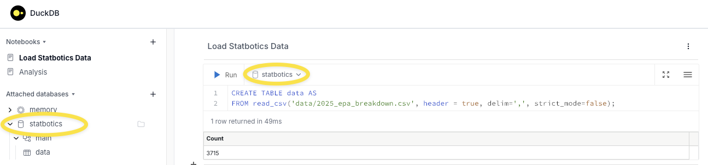
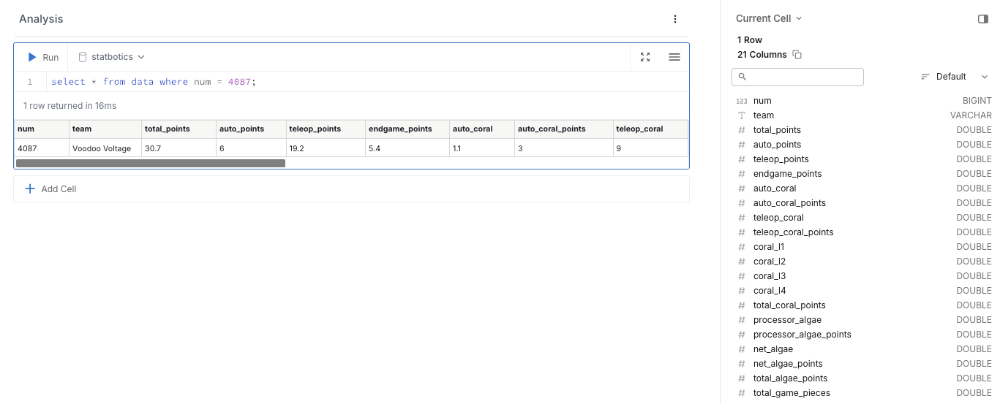

# Setup
## DuckDB
We'll use DuckDB, a SQL-based in-memory analytics database, to query data. It's command-line tool ships with a nice UI.

Follow [theses instructions](https://duckdb.org/docs/installation/?version=stable&environment=cli&platform=macos&download_method=direct) to install DuckDB on your machine. Select the `Command line` environment.

## Data
We'll download data from [statbotics](www.statbotics.io) to analyze.
1. Got to https://www.statbotics.io/teams#breakdown
2. Click `Load All Teams`. This takes a few seconds to complete.
3. Click the download cloud icon and pick `{project root}/data` as the destination. This project includes the data directory in its `.gitignore` already.

# Adding Data
This process only needs to be completed once. The database is stored on disk, so you won't need to redownload the setup data again unless it updates.

Run `duckdb -ui` from the command line then open the produced URL. It should be  http://localhost:4213/.

## Creating the Database
Click the `+` button in the left menu bar next to `Attached Databases` and enter the following information:

- Path: `statbotics.duckdb`
- Alias: `statbotics`

Once you're done, click 'Add database'.
## Adding Data
Click the `+` sign next to `Notebooks` in the left menu and add the following line to the first cell.
```sql
CREATE TABLE data AS
FROM read_csv('data/2025_epa_breakdown.csv', header = true, delim=',', strict_mode=false);
```
Make sure you choose your database alias (`statbotics`) as the database and the string after `FROM` matches where you downloaded the setup data. Load the CSV into a database table called `data` by clicking `Run`.



# Querying Data
With your database setup, we can query the `data` table in our `statbotics` database using [SQL](https://duckdb.org/docs/stable/sql/introduction).

Create a new notebook and run the following and query for our team's data:
```sql
select * from data where num = 4087;
```

We can run a simple query to see the top 10 L1-Coral teams:
```sql
select team, coral_l1 
from data
order by coral_l1 desc
limit 5;
```
Other queries can be found in the `queries/` project directory.